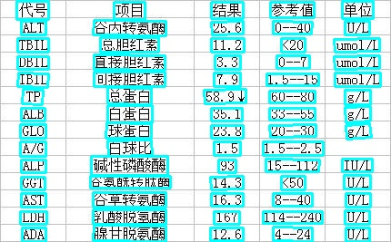

# PP-OCR模型库快速推理

本文介绍针对PP-OCR模型库的Python推理引擎使用方法，内容依次为文本检测、文本识别、方向分类器以及三者串联在CPU、GPU上的预测方法。


- [1. 文本检测模型推理](#文本检测模型推理)

- [2. 文本识别模型推理](#文本识别模型推理)
  - [2.1 超轻量中文识别模型推理](#超轻量中文识别模型推理)
  - [2.2 多语言模型的推理](#多语言模型的推理)

- [3. 方向分类模型推理](#方向分类模型推理)

- [4. 文本检测、方向分类和文字识别串联推理](#文本检测、方向分类和文字识别串联推理)

<a name="文本检测模型推理"></a>

## 1. 文本检测模型推理

文本检测模型推理，默认使用DB模型的配置参数。超轻量中文检测模型推理，可以执行如下命令：

```
# 下载超轻量中文检测模型：
wget  https://paddleocr.bj.bcebos.com/dygraph_v2.0/ch/ch_ppocr_mobile_v2.0_det_infer.tar
tar xf ch_ppocr_mobile_v2.0_det_infer.tar
python3 tools/infer/predict_det.py --image_dir="./doc/imgs/00018069.jpg" --det_model_dir="./ch_ppocr_mobile_v2.0_det_infer/"
```

可视化文本检测结果默认保存到`./inference_results`文件夹里面，结果文件的名称前缀为'det_res'。结果示例如下：



通过参数`limit_type`和`det_limit_side_len`来对图片的尺寸进行限制，
`limit_type`可选参数为[`max`, `min`]，
`det_limit_size_len` 为正整数，一般设置为32 的倍数，比如960。

参数默认设置为`limit_type='max', det_limit_side_len=960`。表示网络输入图像的最长边不能超过960，
如果超过这个值，会对图像做等宽比的resize操作，确保最长边为`det_limit_side_len`。
设置为`limit_type='min', det_limit_side_len=960` 则表示限制图像的最短边为960。

如果输入图片的分辨率比较大，而且想使用更大的分辨率预测，可以设置det_limit_side_len 为想要的值，比如1216：

```
python3 tools/infer/predict_det.py --image_dir="./doc/imgs/1.jpg" --det_model_dir="./inference/det_db/" --det_limit_type=max --det_limit_side_len=1216
```

如果想使用CPU进行预测，执行命令如下

```
python3 tools/infer/predict_det.py --image_dir="./doc/imgs/1.jpg" --det_model_dir="./inference/det_db/"  --use_gpu=False
```


<a name="文本识别模型推理"></a>

## 2. 文本识别模型推理

<a name="超轻量中文识别模型推理"></a>

### 2.1 超轻量中文识别模型推理

超轻量中文识别模型推理，可以执行如下命令：

```
# 下载超轻量中文识别模型：
wget  https://paddleocr.bj.bcebos.com/dygraph_v2.0/ch/ch_ppocr_mobile_v2.0_rec_infer.tar
tar xf ch_ppocr_mobile_v2.0_rec_infer.tar
python3 tools/infer/predict_rec.py --image_dir="./doc/imgs_words/ch/word_4.jpg" --rec_model_dir="ch_ppocr_mobile_v2.0_rec_infer"
```


执行命令后，上面图像的预测结果（识别的文本和得分）会打印到屏幕上，示例如下：

```bash
Predicts of ./doc/imgs_words/ch/word_4.jpg:('实力活力', 0.98458153)
```

<a name="多语言模型的推理"></a>

### 2.2 多语言模型的推理

如果您需要预测的是其他语言模型，在使用inference模型预测时，需要通过`--rec_char_dict_path`指定使用的字典路径, 同时为了得到正确的可视化结果，
需要通过 `--vis_font_path` 指定可视化的字体路径，`doc/fonts/` 路径下有默认提供的小语种字体，例如韩文识别：

```
python3 tools/infer/predict_rec.py --image_dir="./doc/imgs_words/korean/1.jpg" --rec_model_dir="./your inference model" --rec_char_type="korean" --rec_char_dict_path="ppocr/utils/dict/korean_dict.txt" --vis_font_path="doc/fonts/korean.ttf"
```


执行命令后，上图的预测结果为：

``` text
Predicts of ./doc/imgs_words/korean/1.jpg:('바탕으로', 0.9948904)
```

<a name="方向分类模型推理"></a>

## 3. 方向分类模型推理

方向分类模型推理，可以执行如下命令：

```
# 下载超轻量中文方向分类器模型：
wget  https://paddleocr.bj.bcebos.com/dygraph_v2.0/ch/ch_ppocr_mobile_v2.0_cls_infer.tar
tar xf ch_ppocr_mobile_v2.0_cls_infer.tar
python3 tools/infer/predict_cls.py --image_dir="./doc/imgs_words/ch/word_4.jpg" --cls_model_dir="ch_ppocr_mobile_v2.0_cls_infer"
```


执行命令后，上面图像的预测结果（分类的方向和得分）会打印到屏幕上，示例如下：

```
Predicts of ./doc/imgs_words/ch/word_4.jpg:['0', 0.9999982]
```

<a name="文本检测、方向分类和文字识别串联推理"></a>

## 4. 文本检测、方向分类和文字识别串联推理

以超轻量中文OCR模型推理为例，在执行预测时，需要通过参数`image_dir`指定单张图像或者图像集合的路径、参数`det_model_dir`,`cls_model_dir`和`rec_model_dir`分别指定检测，方向分类和识别的inference模型路径。参数`use_angle_cls`用于控制是否启用方向分类模型。`use_mp`表示是否使用多进程。`total_process_num`表示在使用多进程时的进程数。可视化识别结果默认保存到 ./inference_results 文件夹里面。

```shell
# 使用方向分类器
python3 tools/infer/predict_system.py --image_dir="./doc/imgs/00018069.jpg" --det_model_dir="./inference/det_db/" --cls_model_dir="./inference/cls/" --rec_model_dir="./inference/rec_crnn/" --use_angle_cls=true
# 不使用方向分类器
python3 tools/infer/predict_system.py --image_dir="./doc/imgs/00018069.jpg" --det_model_dir="./inference/det_db/" --rec_model_dir="./inference/rec_crnn/" --use_angle_cls=false
# 使用多进程
python3 tools/infer/predict_system.py --image_dir="./doc/imgs/00018069.jpg" --det_model_dir="./inference/det_db/" --rec_model_dir="./inference/rec_crnn/" --use_angle_cls=false --use_mp=True --total_process_num=6
```

执行命令后，识别结果图像如下：


